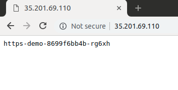
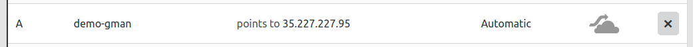
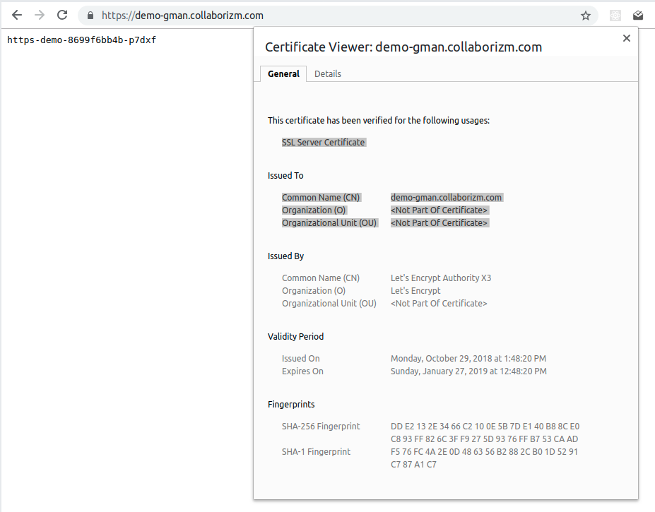

# Using Google Managed  SSL Certificates on GKE  
 
> Special thanks to [@dannyzen](https://github.com/dannyzen) from Google for helping Collaborizm move to GCP. He did help with this post but neither he nor Google endorse its methods.
 
## Getting HTTPS working on GKE can be challenging

Currently there are two main options:

* You can [create certs and add them to your ingress controller](https://cloud.google.com/kubernetes-engine/docs/how-to/ingress-multi-ssl) - 
you'll need to manage your own certs, which seems antiquated post [
Lets Encrypt](https://letsencrypt.org/)        
* Install a certificate provisioning system on your cluster such as [Cert Manager](https://github.com/jetstack/cert-manager) - involves installing extra apps on your cluster, which you'll have to maintain and pay for

There is a third solution: [Google Managed SSL Certs](https://cloud.google.com/load-balancing/docs/ssl-certificates#certificate-resource-status)
 
* They auto renew 
* Offload all SSL handling to Google's Load Balancer (which every GKE cluster uses) 
* Lower infrastructure costs   
 
Downsides:

* In beta and not covered by an SLA
* Use with GKE not fully documented (hence this guide)  
   
**Proceed with caution!!!**

This guide uses an undocumented GKE annotation.
 
 ## Part 1 &middot; Setup a Cluster
 
Create a new GKE project for this to not pollute anything you have in production.
 
Use ```gcloud init``` to create a configuration. 
If you have trouble taming your configurations [check out my other repo](https://github.com/rlancer/GCloud-Configuration-Auto-Switcher), it's a small script to help switch configs based on a .gcloudrc file. 

Clone this repo, we'll be using some YAML from it: 

```bash
$> git clone git@github.com:rlancer/google-managed-certs-gke.git
$> cd gke-https
```

Create a Cluster, for this demo the cluster only needs one small node:

```bash
$> gcloud container clusters create https-demo-cluster --zone us-central1-c --machine-type g1-small --num-nodes 1

>>
NAME                LOCATION       MASTER_VERSION  MASTER_IP       MACHINE_TYPE   NODE_VERSION  NUM_NODES  STATUS
https-demo-cluster  us-central1-c  1.9.7-gke.6     35.226.141.220  n1-standard-1  1.9.7-gke.6   3          RUNNING
```

Connect Kubectl:

```bash
$> gcloud container clusters get-credentials https-demo-cluster --zone us-central1-c 

>> kubeconfig entry generated for https-demo-cluster.
```
Apply configs:  

```bash
$> kubectl apply -f demo-app.yaml
$> kubectl apply -f demo-svc.yaml
$> kubectl apply -f demo-ing.yaml
```

Get the IP address of your Ingress Controller:

> Within a few minutes for the IP address should appear

```bash
$> kubectl get ingress -w 

>>  
NAME       HOSTS    ADDRESS             PORTS       AGE
demo-ing   *                            80          9s
demo-ing   *        35.241.35.109       80          68s
```

Visit the IP address in your browser. Hit refresh if does not appear. It may as long as 10 minutes for the app to be fully available.

The app is simply outputting the name of the host it's running 
on.

 


## Part 2 &middot; Hook up the Google Managed Cert 

Create the Google Managed Cert:

```bash
$> gcloud beta compute ssl-certificates create "demo-gmang-cert" --domains demo-gman.collaborizm.com
```

Get existing URL Maps:
> There should only be one URL Map and you'll need the value under NAME when creating the target proxy in the next step
```bash
$> gcloud compute url-maps list

>>
NAME                                       DEFAULT_SERVICE
k8s-um-default-demo-ing--3287e1f664ff7581  backendServices/k8s-be-31012--3287e1f664ff7581
```

Create the HTTPS Target Proxy. Make sure to sub out the --url-map with your value:
```bash
$> gcloud compute target-https-proxies create https-target --url-map=URL_MAP_VALUE_FROM_ABOVE --ssl-certificates=demo-gmang-cert

>> 
Created [https://www.googleapis.com/compute/v1/projects/kube-https-demo/global/targetHttpsProxies/https-target].

NAME          SSL_CERTIFICATES  URL_MAP
https-target  demo-gmang-cert   k8s-um-default-demo-ing--3287e1f664ff7581
```

Create a Global Static IP Address:
```bash
$> gcloud compute addresses create static-https-ip --global --ip-version IPV4

>> Created [https://www.googleapis.com/compute/v1/projects/kube-https-demo/global/addresses/static-https-ip].
```

Create a Global Forwarding Rule linking youre newly created IP Address:
```bash
$> gcloud compute forwarding-rules create https-global-forwarding-rule --global --ip-protocol=TCP --ports=443 --target-https-proxy=https-target --address static-https-ip 
``` 

Adjust the Service to include the Target Proxy, edit demo-svc.yaml to include the target-proxy Annotation. **This is undocumented, could be a bad move...**

```yaml
apiVersion: v1
kind: Service
metadata:
  name: demo-svc
  # Add this annotation
++  annotations:
++    ingress.kubernetes.io/target-proxy: https-target
spec:
  type: NodePort
  selector:
    run: https-demo
  ports:
  - name: http
    protocol: TCP
    port: 333
    targetPort: 9376
```

Apply the new Service:
```bash
$> kubetl apply -f demo-svc.yaml
```

Get the IP Address assigned to the Target Proxy:
```bash
$> gcloud compute addresses list
 
>>
NAME             REGION  ADDRESS        STATUS
static-https-ip          35.227.227.95  IN_USE

```
Create an A Record with the IP Address (on CloudFlare we turned off proxying, hence the gray cloud)



Watch to see if your Cert has been provisioned, this could take as long as half an hour: 

```bash
$> watch gcloud beta compute ssl-certificates list

>>
demo-gmang-cert  MANAGED  2018-10-29T10:47:05.450-07:00  2019-01-27T09:48:20.000-08:00  ACTIVE
    demo-gman.collaborizm.com: ACTIVE
```

Next visit [https://demo-gman.collaborizm.com](https://demo-gman.collaborizm.com) in your browser and you should see your GKE app running with a Google Managed Cert.



## Interested in Google Cloud Platform?

Start or join a project on [Collaborizm](https://www.collaborizm.com)! Our partnership with GCP could net you a few grand in credits. 
